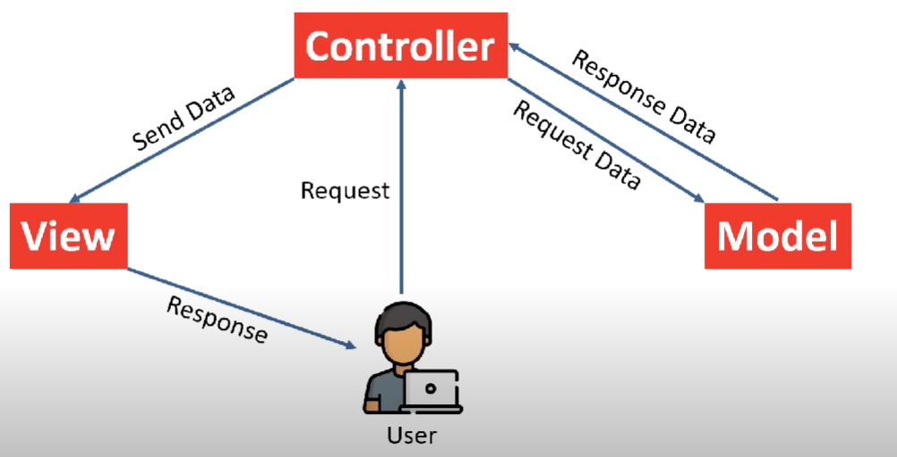
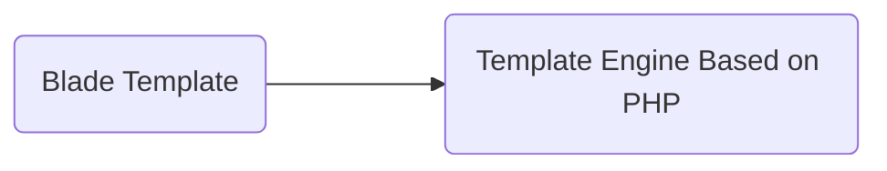

## Laravel
#### Day1
|Day1|Topics|
|---|---|
|1|[laravel-introduction](#1laravel-introduction)|
|2|Laravel setup Laravel `Herd`|
|3|[laravel-installation](#3laravel-installation)|
|4|[Folder Structure](#4laravel-folder--file-structure)|
|5|[routing-basics](#5laravel-routing-basics)|
|6|[routing-parameters](#6laravel-routing-parameters--constraints)|
|7|[Laravel Named Route](#7laravel-named-route--routes-group)|
|8|[Laravel Blade](#8laravel-blade-template---i)|
|9|[Laravel Blade II](#9laravel-blade-template---ii)|
|10|[Laravel Blade III](#10laravel-blade-template---iii)|
### 1.Laravel Introduction
    - Laravel is a free, open-source and one of the
    more popular `PHP web Framework` based on `MVC` architectural pattern.
    - created by Taylor Otwell in june 2011
    - Laravel Followes MVC Pattern

#### Uses of Laravel
*
    - Create Web Apps
    - Create APIs

#### What is MVC Pattern?
*
    - Model
        - Database Related Task
        - SQL Queries
    - View
        - User interface
        - HTML,CSS
    - Controller
        - Business Logic
        - Mediator between Model and View
    - MVC Principle
        - Separation of concerns.
        - Code Organization

#### MVC Pattern Work Flow
*
    

#### How to code in MVC Framework?
*
    - **Controller** (controllers/my_controller.php) 
    ```php
    function total_frogs(){
    Sthis->load->model("frogs");
    Snumber_of_frogs= Sthis->frogs->count_frogs();
    $data['froggies']=$number_of_frogs;
    $this->load->view("frog_view", $data);

    }
    ```
    - **Model** (models/frogs.php)
    ```php
    function count_frogs(){
    Sthis->db->where("type","frog");
    Sthis->db->from("animals"); &
    Squery = Sthis->db->get();
    return $query->numb_rows();

    }
    ```
    - **View** (views/frog_view.php)
    ```php
    <html>
        <body>
            <h1>You've <?=$name;?></h1>
        </body>
    </html>
    ```

#### Benefits of MVC Framework
*
    - Organized Code
    - Independent Block
    - Reduces the complexity of Web Applications
    - Easy to maintain
    - Easy to modify
    - Code reusability
    - Improved collaboration *
    - Platform independence

    ##### PHP MVC Frameworks
    *
        * Laravel
        * Symfony
        * Codelgniter
        * Yii
        * CakePHP
        * Zend Framework

#### What is Framework?
*
    - Programming frameworks are sets of pre-written code and libraries that
    provide a foundation for developing software applications.

    - **Pre-written Code & Library**
        - Tools
        - Components
        - Modules
    - **Examples**
        - Database Component
        - Caching 
        - Pagination 
        - Session management 
        - Form Handling 
        - Security mechanisms 
        - User authentication 
        - APIs 
        - Payment Gateways
    - **Benefits**
        - Code organization 
        - Reusability 
        - Standardization 
        - Testing & debugging support 
        - Community and support 

#### Benefits of Laravel Framework
*
    - Open source
    - Elegant syntax
    - MVC architecture
    - Database migration and ORM
    - Robust routing system
    - Command-line Interface (Composer)
    - Powerful template engine (Blade Template)
    - Authentication and authorization
    - Testing and debugging 
    - Security (XSS, CSRF, SQL injection) 
    - Scalability and performance (Redis and Memcached)
    - Robust ecosystem and community
    - Laravel Documentation

#### Main Topics of Laravel
*
    * Artisan CLI 
    * Migration
    * Routing 
    * Middleware
    * Views 
    * Form Validation
    + Blade Template 
    * Authentication
    * Controllers 
    * Handling File Upload
    * Model 
    * APIs Validation
    * Database 
    * CRUD Project
    * Eloquent ORM 
    * News Blog Project

### 3.Laravel installation
*
    ```
    composer create-project laravel/laravel example-app
    ```
    - composer create-project laravel/laravel=10 myProject
#### Laravel Extensions
*
    - PHP IntelliSense (Damjan Cvetko)
    - PHP Namespace Resolver (Mehedi Hassan)
    - Laravel Extra Intellisense (amir)
    - laravel-blade (Christian Howe)
    - Laravel Blade Snippets (Winnie Lin)
    - Laravel goto view (codingyu)

### 4.Laravel Folder & File Structure
*
    1. Model Folder ————————> Database / SQL Queries Handling 1. Files
    1. Controller Folder —————> Business Logics Files
    1. View Folder ——————————> HTML Files
    1. Routing Folder ——————> URL Defining Files
    1. Assets Folder (Public folder) —————————> Images / Fonts / Music / Videos Files CSS / JavaScript Files


### 5.Laravel Routing Basics
*
    ```php
    Route::get('/', function () {
        return view('welcome');
    });

    ```
    #### php artisan route commands
    - php artisan
    - php artisan route -h
    - php artisan route:list
    - php artisan route:list --except-vendor
    - php artisan route:list --path=post

### 6.Laravel Routing Parameters & Constraints
*
    ```php
    http://localhost/post/yahoobaba 
    http://localhost/post/news10 
    http://localhost/post/@news10 
    Route::get('/post/{id}, function (string $id) { 
    return 'User ' . $id; 
    });
    ```
    - ‘http://localhost/post/10 whereNumber('id') 
    - http://localhost/post/nabin whereAlpha('name’)
    - http://localhost/post/news10 whereAlphaNumeric('name’)
    - http://localhost/post/song whereln('category', ['movie', song’)
    - http://localhost/post/@10  where('id', '[@0-9]+')

    ```php
    Route::get('/post/{id}', function (string $id) {
    return 'User '. Sid;
    })->whereNumber('id');
    ```
### 7.Laravel Named Route & Routes Group
1. **Named Route**
    ```php
    Route::get('/hjfbvjhfd', function () {
        return view('post');
    })->name('mypost');
    ```
1. Routes Group
    ```php
    Route::prefix('page')->group(function () {
        Route::get('/about', function () {
            return view('welcome');
        })->name('myhome');

        Route::get('/gallery', function () {
            return view('welcome');
        })->name('gallery');

        Route::get('/post', function () {
            return view('post');
        })->name('post');
    });
    ```
1. Page Note Found 404
    ```php
    Route::fallback(function () {
        return "<h1>Page Note Found.</h1>";
    });
    ```
### 8.Laravel Blade Template - I

1. Benefits : Create Dynamic and Reusable Templates
1. Blade provides a clean and convenient way to create views in Laravel
1. Same code with php and blade template
    ```php
        // php
        <?php echo "Hello"; ?>
        <?php echo $name; ?>
        <?php echo "<h1>Hello</h1>" ?>

        // blade template
        {{"Hello"}}
        {{$name}}
        {{!! "<h1>Hello</h1>" !!}}
    ```
1. Blade Prevent: cross-site scripting (XSS) Attacks
    ```php
        <?php 
            //php code 
        ?>
        @php 
            {--commet--}
        @endphp
    ```
1. Basic syntex of blade
    ```php
        <?php
        if(condition){
            //statement
        }else{
            //statement
        }
        ?>
        //blade
        @if(condition)
            //statement
        @else
            //statement
        @endif
    ```
1. if in blade
    ```php
        @switch($i)
            @case(1)
                //first case
                @break
            @default
                //default case
            @endswitch
    ```
1. switch in blade
    ```php
        @isset($record)
            //$record is default and is not null
        @endisset
    ```
1. isset in blade

1. [**Laravel Blade docs**](https://laravel.com/docs/11.x/blade)

    ```php
        @for ($i = 0; $i < 10; $i++)
        The current value is {{ $i }}
        @endfor

        @foreach ($users as $user)
        <p>This is user {{ $user }</p>
        @endforeach

        @while (condition)
        <p>Loop Statement</p>
        @endwhile

        @forelse ($users as $user)
        <li>{{ $user->name }}</li>
        @empty
        <p>No users</p>
        @endforelse

        @continue
        @break
    ```
1. Loops for, foreach, while, forelse

    |Property| Description |
    |---|---|
    |$loop->index| The index of the current loop iteration (starts at 0). |
    |$loop->iteration| The current loop iteration (starts at 1). |
    |$loop->remaining| The iterations remaining in the loop. |
    |$loop->count| The total number of items in the array being iterated. |
    |$loop->first| Whether this is the first iteration through the loop. |
    |$loop->last| Whether this is the last iteration through the loop. |
    |$loop->even| Whether this is an even iteration through the loop. |
    |$loop->odd| Whether this is an odd iteration through the loop. |
    |$loop->depth| The nesting level of the current loop. |
    |$loop->parent| When in a nested loop, the parent's loop variable. |

    ```php
        @php
        $names = ['surej', 'rajan', 'himal', 'nabin'];
        @endphp

        <ul>
            @foreach ($names as $name)
                @if ($loop->even)
                    <li style="color: red">{{ $name }}</li>
                @elseif ($loop->odd)
                    <li style="color: green">{{ $name }}</li>
                    {{-- @else
                    <li>{{ $name }}</li> --}}
                @endif
            @endforeach
        </ul>
    ```
1. Basic example

1. Blade Loop Variable for `@foreach`

### 9.Laravel Blade Template - II
- Including Subviews/Directives
    1. @include
    1. @section
    1. @extend
    1. @yield
- Reusable Templates
    ```php
        first.blade.php             second.blade.php
        <h1>First Page</h1>         <h1>Second Page</h1>
        {{ $status }} `Include View` @include(first)
        @include()

        @include('first', ['status' => 'Hello'])
    ```
- passing props in laravel
    ```php
        {{-- @include --}}
        {{-- prpos --}}
        @php
            $fruits = ['one' => 'Apple', 'two' => 'Mango', 'three' => 'banana', 'four' => 'orange'];
            $age = 20;
        @endphp
        {{-- @include('pages.header', ['names' => $fruits]) --}}
        {{-- @includeWhen($age > 18 ? true : false, 'pages.header', ['names' => $fruits]) --}}
        @includeUnless($age > 18 ? true : false, 'pages.header', ['names' => $fruits])
        <h1>Home page</h1>

        @include('pages.footer')
        @includeIf('pages.contact')
    ```
### 10.Laravel Blade Template - III
- Template main directives
    1. @section
    1. @extend
    1. @yield
- template inheritance
```php
// master layout
@yield('title', 'web')

// other pages
@extends('layouts.masterlayout');

@section('content')
    <h2>Home page</h2>
    <p>Lorem ipsum dolor sit amet consectetur</p>
@endsection

@section('title')
    Home
@endsection

// master layout
@hasSection('content')
    @yield('content')
@else
    <h1>No Content Found</h1>
@endif

// other
@section('sidebar')
    @parent
    <p>This is appended to the sidebar</p>
@endsection
```