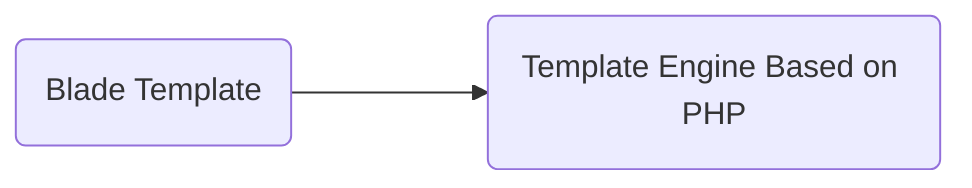

## Laravel
### TOC
|No|Day|Total Topics|
|---|---|---|
|1|[day1](#day1)|10|
|2|[day2](#day2)|7|
#### Day1
|No|Topics|
|---|---|
|1|[laravel-introduction](#1laravel-introduction)|
|2|Laravel setup Laravel `Herd`|
|3|[laravel-installation](#3laravel-installation)|
|4|[Folder Structure](#4laravel-folder--file-structure)|
|5|[routing-basics](#5laravel-routing-basics)|
|6|[routing-parameters](#6laravel-routing-parameters--constraints)|
|7|[Laravel Named Route](#7laravel-named-route--routes-group)|
|8|[Laravel Blade](#8laravel-blade-template---i)|
|9|[Laravel Blade II](#9laravel-blade-template---ii)|
|10|[Laravel Blade III](#10laravel-blade-template---iii)|
### 1.Laravel Introduction
*
    - Laravel is a free, open-source and one of the
    more popular `PHP web Framework` based on `MVC` architectural pattern.
    - created by Taylor Otwell in june 2011
    - Laravel Followes MVC Pattern

#### Uses of Laravel
*
    - Create Web Apps
    - Create APIs

#### What is MVC Pattern?
*
    - Model
        - Database Related Task
        - SQL Queries
    - View
        - User interface
        - HTML,CSS
    - Controller
        - Business Logic
        - Mediator between Model and View
    - MVC Principle
        - Separation of concerns.
        - Code Organization

#### MVC Pattern Work Flow
*
    

#### How to code in MVC Framework?
*
    - **Controller** (controllers/my_controller.php) 
    ```php
    function total_frogs(){
    Sthis->load->model("frogs");
    Snumber_of_frogs= Sthis->frogs->count_frogs();
    $data['froggies']=$number_of_frogs;
    $this->load->view("frog_view", $data);

    }
    ```
    - **Model** (models/frogs.php)
    ```php
    function count_frogs(){
    Sthis->db->where("type","frog");
    Sthis->db->from("animals"); &
    Squery = Sthis->db->get();
    return $query->numb_rows();

    }
    ```
    - **View** (views/frog_view.php)
    ```php
    <html>
        <body>
            <h1>You've <?=$name;?></h1>
        </body>
    </html>
    ```

#### Benefits of MVC Framework
*
    - Organized Code
    - Independent Block
    - Reduces the complexity of Web Applications
    - Easy to maintain
    - Easy to modify
    - Code reusability
    - Improved collaboration *
    - Platform independence

    ##### PHP MVC Frameworks
    *
        * Laravel
        * Symfony
        * Codelgniter
        * Yii
        * CakePHP
        * Zend Framework

#### What is Framework?
*
    - Programming frameworks are sets of pre-written code and libraries that
    provide a foundation for developing software applications.

    - **Pre-written Code & Library**
        - Tools
        - Components
        - Modules
    - **Examples**
        - Database Component
        - Caching 
        - Pagination 
        - Session management 
        - Form Handling 
        - Security mechanisms 
        - User authentication 
        - APIs 
        - Payment Gateways
    - **Benefits**
        - Code organization 
        - Reusability 
        - Standardization 
        - Testing & debugging support 
        - Community and support 

#### Benefits of Laravel Framework
*
    - Open source
    - Elegant syntax
    - MVC architecture
    - Database migration and ORM
    - Robust routing system
    - Command-line Interface (Composer)
    - Powerful template engine (Blade Template)
    - Authentication and authorization
    - Testing and debugging 
    - Security (XSS, CSRF, SQL injection) 
    - Scalability and performance (Redis and Memcached)
    - Robust ecosystem and community
    - Laravel Documentation

#### Main Topics of Laravel
*
    * Artisan CLI 
    * Migration
    * Routing 
    * Middleware
    * Views 
    * Form Validation
    + Blade Template 
    * Authentication
    * Controllers 
    * Handling File Upload
    * Model 
    * APIs Validation
    * Database 
    * CRUD Project
    * Eloquent ORM 
    * News Blog Project

### 3.Laravel installation
*
    ```
    composer create-project laravel/laravel example-app
    ```
    - composer create-project laravel/laravel=10 myProject
#### Laravel Extensions
*
    - PHP IntelliSense (Damjan Cvetko)
    - PHP Namespace Resolver (Mehedi Hassan)
    - Laravel Extra Intellisense (amir)
    - laravel-blade (Christian Howe)
    - Laravel Blade Snippets (Winnie Lin)
    - Laravel goto view (codingyu)

### 4.Laravel Folder & File Structure
*
    1. Model Folder ————————> Database / SQL Queries Handling 1. Files
    1. Controller Folder —————> Business Logics Files
    1. View Folder ——————————> HTML Files
    1. Routing Folder ——————> URL Defining Files
    1. Assets Folder (Public folder) —————————> Images / Fonts / Music / Videos Files CSS / JavaScript Files


### 5.Laravel Routing Basics
*
    ```php
    Route::get('/', function () {
        return view('welcome');
    });

    ```
    #### php artisan route commands
    - php artisan
    - php artisan route -h
    - php artisan route:list
    - php artisan route:list --except-vendor
    - php artisan route:list --path=post

### 6.Laravel Routing Parameters & Constraints
*
    ```php
    http://localhost/post/yahoobaba 
    http://localhost/post/news10 
    http://localhost/post/@news10 
    Route::get('/post/{id}, function (string $id) { 
    return 'User ' . $id; 
    });
    ```
    - ‘http://localhost/post/10 whereNumber('id') 
    - http://localhost/post/nabin whereAlpha('name’)
    - http://localhost/post/news10 whereAlphaNumeric('name’)
    - http://localhost/post/song whereln('category', ['movie', song’)
    - http://localhost/post/@10  where('id', '[@0-9]+')

    ```php
    Route::get('/post/{id}', function (string $id) {
    return 'User '. Sid;
    })->whereNumber('id');
    ```
### 7.Laravel Named Route & Routes Group
1. **Named Route**
    ```php
    Route::get('/hjfbvjhfd', function () {
        return view('post');
    })->name('mypost');
    ```
1. Routes Group
    ```php
    Route::prefix('page')->group(function () {
        Route::get('/about', function () {
            return view('welcome');
        })->name('myhome');

        Route::get('/gallery', function () {
            return view('welcome');
        })->name('gallery');

        Route::get('/post', function () {
            return view('post');
        })->name('post');
    });
    ```
1. Page Note Found 404
    ```php
    Route::fallback(function () {
        return "<h1>Page Note Found.</h1>";
    });
    ```
### 8.Laravel Blade Template - I

1. Benefits : Create Dynamic and Reusable Templates
1. Blade provides a clean and convenient way to create views in Laravel
1. Same code with php and blade template
    ```php
        // php
        <?php echo "Hello"; ?>
        <?php echo $name; ?>
        <?php echo "<h1>Hello</h1>" ?>

        // blade template
        {{"Hello"}}
        {{$name}}
        {{!! "<h1>Hello</h1>" !!}}
    ```
1. Blade Prevent: cross-site scripting (XSS) Attacks
    ```php
        <?php 
            //php code 
        ?>
        @php 
            {--commet--}
        @endphp
    ```
1. Basic syntex of blade
    ```php
        <?php
        if(condition){
            //statement
        }else{
            //statement
        }
        ?>
        //blade
        @if(condition)
            //statement
        @else
            //statement
        @endif
    ```
1. if in blade
    ```php
        @switch($i)
            @case(1)
                //first case
                @break
            @default
                //default case
            @endswitch
    ```
1. switch in blade
    ```php
        @isset($record)
            //$record is default and is not null
        @endisset
    ```
1. isset in blade

1. [**Laravel Blade docs**](https://laravel.com/docs/11.x/blade)

    ```php
        @for ($i = 0; $i < 10; $i++)
        The current value is {{ $i }}
        @endfor

        @foreach ($users as $user)
        <p>This is user {{ $user }</p>
        @endforeach

        @while (condition)
        <p>Loop Statement</p>
        @endwhile

        @forelse ($users as $user)
        <li>{{ $user->name }}</li>
        @empty
        <p>No users</p>
        @endforelse

        @continue
        @break
    ```
1. Loops for, foreach, while, forelse

    |Property| Description |
    |---|---|
    |$loop->index| The index of the current loop iteration (starts at 0). |
    |$loop->iteration| The current loop iteration (starts at 1). |
    |$loop->remaining| The iterations remaining in the loop. |
    |$loop->count| The total number of items in the array being iterated. |
    |$loop->first| Whether this is the first iteration through the loop. |
    |$loop->last| Whether this is the last iteration through the loop. |
    |$loop->even| Whether this is an even iteration through the loop. |
    |$loop->odd| Whether this is an odd iteration through the loop. |
    |$loop->depth| The nesting level of the current loop. |
    |$loop->parent| When in a nested loop, the parent's loop variable. |

    ```php
        @php
        $names = ['surej', 'rajan', 'himal', 'nabin'];
        @endphp

        <ul>
            @foreach ($names as $name)
                @if ($loop->even)
                    <li style="color: red">{{ $name }}</li>
                @elseif ($loop->odd)
                    <li style="color: green">{{ $name }}</li>
                    {{-- @else
                    <li>{{ $name }}</li> --}}
                @endif
            @endforeach
        </ul>
    ```
1. Basic example

1. Blade Loop Variable for `@foreach`

### 9.Laravel Blade Template - II
- Including Subviews/Directives
    1. @include
    1. @section
    1. @extend
    1. @yield
- Reusable Templates
    ```php
        first.blade.php             second.blade.php
        <h1>First Page</h1>         <h1>Second Page</h1>
        {{ $status }} `Include View` @include(first)
        @include()

        @include('first', ['status' => 'Hello'])
    ```
- passing props in laravel
    ```php
        {{-- @include --}}
        {{-- prpos --}}
        @php
            $fruits = ['one' => 'Apple', 'two' => 'Mango', 'three' => 'banana', 'four' => 'orange'];
            $age = 20;
        @endphp
        {{-- @include('pages.header', ['names' => $fruits]) --}}
        {{-- @includeWhen($age > 18 ? true : false, 'pages.header', ['names' => $fruits]) --}}
        @includeUnless($age > 18 ? true : false, 'pages.header', ['names' => $fruits])
        <h1>Home page</h1>

        @include('pages.footer')
        @includeIf('pages.contact')
    ```
### 10.Laravel Blade Template - III
- Template main directives
    1. @section
    1. @extend
    1. @yield
- template inheritance
```php
// master layout
@yield('title', 'web')

// other pages
@extends('layouts.masterlayout');

@section('content')
    <h2>Home page</h2>
    <p>Lorem ipsum dolor sit amet consectetur</p>
@endsection

@section('title')
    Home
@endsection

// master layout
@hasSection('content')
    @yield('content')
@else
    <h1>No Content Found</h1>
@endif

// other
@section('sidebar')
    @parent
    <p>This is appended to the sidebar</p>
@endsection
```

#### Day2 
[goto-toc⤴️](#toc)
|No|Topics|
|---|---|
|11|[js in balde](#11blade-template---iv-js-in-blade)|
|12|[data-passing](#12data-passing-route-to-view)|
|13|[controller](#13controller-in-laravel)|
|14|[features-of-laravel-11](#14features-of-laravel-11)|
|15|[database-migration](#15database-migration)|
|16|[migration-modifiers](#16migration-modifiers-and-constraints)|
|17|[migration-primary-foreign-key](#17migration-primary--foreign-key)|

### 11.Blade Template - IV JS in Blade
*
    - How to write js in blade template
    ```php
        @php
            $user = 'Hello';
            $frouts = ['Apple', 'Mango', 'Banana', 'Litchi'];
        @endphp

        <script>
            // let data = @json($frouts);

            let data = {{ Js::from($frouts) }}
            data.map((val) => {
                console.log(val);
            })
        </script>
    ```
    - Js in Template Inheritance
    ```php
        //define
        @stack('script')

        //use
        @extends('layout')
        @push('script')
            <script src="/example.js"></script>
        @endpush
    ```
    - style (CSS)
    ```php
        @push('style')
            <link rel="stylesheet" href="css/bootstrap.css">
        @endpush

        @prepend (‘style’)
            <style>
                #wrapper{
                    background: tan;

                    }
            </style>
        @endprepend
    ```
    - javascript Framework (VueJs)
    ```php
        @verbatim
            {{user}}
        @endverbatim
    ```
    - use Vue.js in laravel
    ```php
        @verbatim
            <div id="app">{{ message }}</div>
        @endverbatim
        @push('scripts')
            <script src="https://unpkg.com/vue@3/dist/vue.global.js"></script>

            <script>
                const {
                    createApp,
                    ref
                } = Vue

                createApp({
                    setup() {
                        const message = ref('Hello vue!')
                        return {
                            message
                        }
                    }
                }).mount('#app')
            </script>
        @endpush
    ```
### 12.Data Passing Route to View
*
    - Dynamic Data Passing
    ```php
        function getUsers()
        {
            return  [
                1 => ['name' => 'Amitabh', 'phone' => '9123456789', 'city' => 'Goa'],
                2 => ['name' => 'Salman', 'phone' => '9123456789', 'city' => 'Delhi'],
                3 => ['name' => 'Sunny', 'phone' => "9123456789", 'city' => 'Mumbai'],
                4 => ['name' => 'Akshay', 'phone' => '9123456789', 'city' => 'Agra'],
            ];
        }

        Route::get('/users', function () {
        $names = getUsers();
            return view('users', [
                'users' => $names,
                'city' => 'Delhi'
            ]);
        });

        Route::get('/user/{id}', function ($id) {

            $users = getUsers();
            abort_if(!isset($users[$id]), 404);
            $user = $users[$id];
            return view('user', ['id' => $user]);
        })->name("view.user");
    ```
### 13.Controller in Laravel
*
    - To work on controller we should follow these three steps
        1. Create Controller File
            * To create Controller:
            * `php artisan make:controller UserController`
            * Then it will create: `UserController.php`
        ```php
        class UserController extends Controller
        {
            public function show()
            { 
                return view('user.profile');

            } 

        }
        // then add it to route
        use App\Http\Controllers\UserController;
        Route::get('/user', [UserController::class, 'show']);
        ```
        1. Create Controller class
        1. Create Route
        ```php
        PageController.php
        <?php
            namespace App\Http\Controllers;

            use Illuminate\Http\Request;

            class PageController extends Controller
            {
                public function showHome()
                {
                    return view("welcome");
                }
                public function showUser(string $id)
                {
                    // return view("user", ["id" => $id]);
                    return view("user", compact("id"));
                }
                public function showBlog()
                {
                    return view("blog");
                }
            }

        ```
        ```php
            web.php

            Route::get("/", [PageController::class, 'showHome'])->name('home');

            // route group
            Route::controller(PageController::class)->group(function () {
                Route::get("/", 'showHome')->name('home');
                Route::get("/blog", 'showBlog')->name('blog');
                Route::get("/user/{id}", 'showUser')->name('user');
            });

        ```
        - Single Action Controller
        ```php
            php artisan make:controller TestingController --invokable
            or
            php artisan make:controller TestingController --i

            class TestController extends Controller
            {
                public function __invok ()

                {
                    return view('test');

                } 

            }

            Route::get('/test', TestingController::class);
        ```
        - myProject>php artisan route:list --except-vendor
        - php artisan route:list --path=user
### 14.Features of Laravel 11
### 15.Database Migration
- How to Work with Database
    1. Create Database
    1. Create Tables in Database(column Namw, Datatype)
    1. Insert Initial Data in Tables
    1. Code with Database
#### Steps
1. Create Database
1. Create Database Migration
    - (Create tables in database)
1. Seeding
    - (Insert Initial Data in Tables)
    - php artisan make:migration create_students_table
1. Create Model

#### Mysql DataTypes
1. CHAR(size)
1. VARCHAR (size)
1. BINARY(size)
1. VARBINARY(size)
1. TINYTEXT
1. TEXT(size)
1. MEDIUMTEXT
1. LONGTEXT
1. TINYBLOB
1. BLOB(size)
1. MEDIUMBLOB
1. LONGBLOB
1. ENUM(val1, val2, val3, ...)
1. SET(vall, val2, val3,..)
1. BIT(size) 1to64
1. TINYINT(size) -128 to 127
1. INT(size) -2147483648 to 2147483647
1. INTEGER(size)
1. SMALLINT(size) -32768 to 32767
1. MEDIUMINT(size) -8388608 to 8383607
1. BIGINT(size) -9223372036854775808 to 1. 9223372036854775807
1. BOOL
1. BOOLEAN 0/1
1. FLOAT(p)
1. DOUBLE(size, d) 255.568
1. DECIMAL(size, d) size = 60, d = 30
1. DEC(size,d)

#### [Laravel Migration Avilable Datatypes Docs](https://laravel.com/docs/11.x/migrations#available-column-types)
#### PHP Artisan Migration Commands
1. php artisan make:migration
1. php artisan make:migration create_students_table / tablename
1. php artisan migrate
1. php artisan migrate:status
1. php artisan migrate:rollback
1. php artisan migrate:reset
1. php artisan migrate:refresh
1. php artisan migrate:fresh
1. php artisan make:model Task -m

### 16.Migration Modifiers and constraints
- Types of Modifications
    - Column Modifications
        1. Add New Column
        1. Rename Column
        1. Delete Column
        1. Change Column Order
        1. Change Datatype or Size of Column
    - Table Modifications
        1. Rename Table
        1. Delete Table
#### Laravel:Modify Column with Migration
```php
$table->renameColumn(‘from’, 'to'); 

MySQL <8.0.3
MariaDB < 10.5.2

$table->dropColumn('city');
$table->dropColumn(['city’, ‘avatar’, 'location']);
$table->string('name', 50)->change();
$table->integer('votes')->unsigned()->default(1)->comment('my comment')->change();

Change Column Order
$table after('password’, function (Blueprint $table) {
    $table->string('address');
    $table->string('city');
});
```
### MYSQL Constraints with Migration
* NOT NULL
* UNIQUE
* DEFAULT
* PRIMARY KEY
* FOREIGN KEY
* CHECK
```php
    Stable->string(‘email')->nullable();
    Stable->string(‘'email')->unique();
    Stable->unique('email’);
    Stable->string('city')->default('Agra');
    Stable->primary('user_id');
    Stable->foreign('user_id')->references('id')->on('users');
    DB::statement('ALTER TABLE users ADD CONSTRAINT age CHECK (age > 18);');
```
|Modifier|Description|
|---|---|
|->after('column’)| Place the column "after" another column (MySQL).|
|->autoIncrement()| Set INTEGER columns as auto-incrementing (primary key).|
|->comment('my comment’)| Add a comment to a column (MySQL/PostgreSQL).|
|->first()| Place the column "first" in the table (MySQL).|
|->from(Sinteger)| Set the starting value of an auto-incrementing field (MySQL / PostgreSQL).|
|->invisible()| Make the column "invisible" to SELECT * queries (MySQL).|
|->unsigned()| Set INTEGER columns as UNSIGNED (MySQL).|
|->useCurrent()| Set TIMESTAMP columns to use CURRENT_TIMESTAMP as default value.|
|->useCurrentOnUpdate()| Set TIMESTAMP columns to use CURRENT_TIMESTAMP when a record is updated (MySQL).|

### 17.Migration Primary & Foreign Key
```php
// create primary key
$table->primary('Cid');
// create foreign key
$table->foreign('city')->references('Cid')->on('City');
```
- Foreign Key with Cascade
```php
Stable->foreign('City_id')->references('Cid')->on('City’)
    ->onUpdate('cascade')
    ->onDelete('cascade’);

cascadeOnUpdate();
cascadeOnDelete();
restrictOnUpdate();
restrictOnDelete();
nullOnDelete();
```
- 3way to make foreign key
```php
$table->foreign('stu_id')->references('id')->on('students'); 
$table->foreignId('stu_id')->constrained (‘students’); 
$table->unsignedBiginteger('student_id'); 
$table->foreignId('student_id')->constratined();
```
- Drop key Constraints
- php artisan make:migration update_library_table --table=libraries
- php artisan migrate:refresh
```php
$table->dropPrimary('users_id_primary');
$table->dropUnique('users_email_unique');
$table->dropForeign('posts_user_id_foreign');
$table->dropForeign(['user_id']);
```